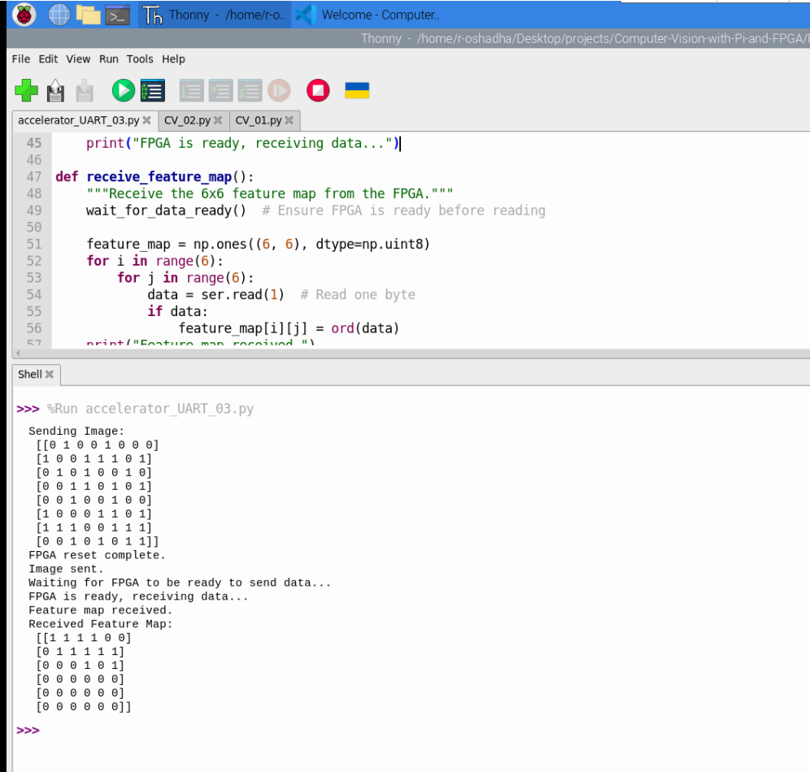
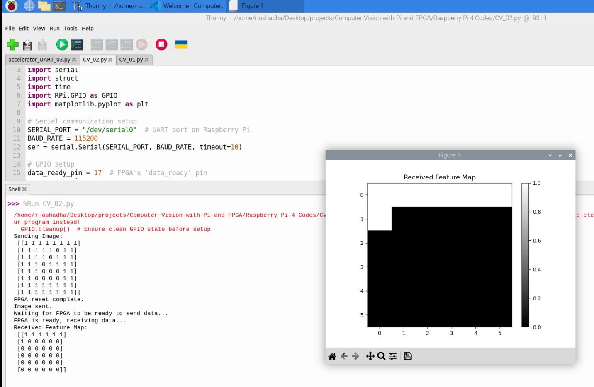
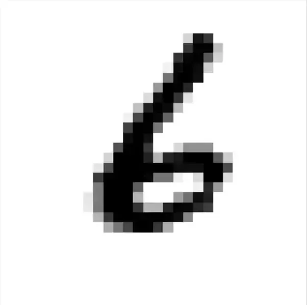
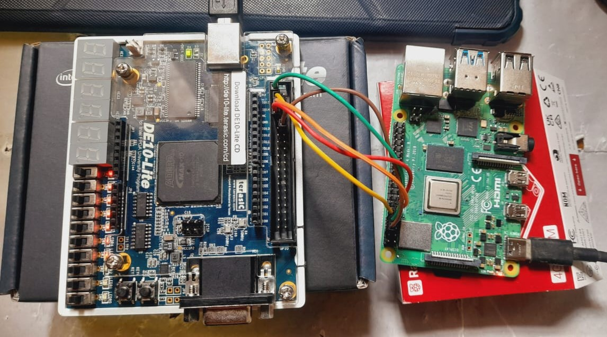

# 🚀 **Computer Vision with Pi and FPGA**

## 📝 Project Overview
This project explores the integration of **FPGA acceleration with a Raspberry Pi 4B for computer vision tasks**. The goal is to develop a **binary convolutional neural network (CNN)** accelerator using a **DE10-Lite FPGA**, enabling efficient edge processing. The FPGA receives an 8×8 binary image matrix from the Raspberry Pi, performs binary convolution-based edge detection, and returns a 6×6 feature map for further processing.

Testing includes **UART communication** verification and handwritten digit processing using OpenCV. The project is still in development, with ongoing debugging and improvements. Future iterations will focus on optimizing FPGA processing and implementing a complete CNN accelerator for real-time image analysis. This initiative lays the foundation for low-power, high-speed vision processing on embedded systems. 

---

## 📁 Project Structure
### 🔹 Main Folders:
1. **📁 Final_Project_Outcomes** - Contains the final **SystemVerilog** implementations.
2. **📁 Raspberry_Pi-4_Codes** - Contains the final **Raspberry Pi** scripts for processing images and interfacing with the FPGA.

### **📁 Final_Project_Outcomes (FPGA Implementation)**
📂 This folder contains SystemVerilog modules used for **UART communication** and **edge detection processing**:
- 🏆 `uart_edge_detection.sv` - **Top module** performing binary convolution-based edge detection.
- 🔄 `uart_echo.sv` - Simple UART echo test module.
- 🔁 `uart_echo_repeated.sv` - Extended UART echo module for repeated transmissions.
- 📥 `uart_rx.sv` - UART **receiver** module.
- 📤 `uart_tx.sv` - UART **transmitter** module.

### **📁 Raspberry_Pi-4_Codes (Software Implementation)**
📂 This folder contains Python scripts for communication and image processing:
- 📡 `accelerator_UART_01.py` to `accelerator_UART_03.py` - Test scripts sending an **8×8 binary matrix** to the FPGA and receiving a **6×6 feature map**.
- ✍️ `CV_01.py`, `CV_02.py` - Final scripts that **read a handwritten number image**, convert it into an **8×8 binary matrix**, and send it to the FPGA for processing.
- 🔧 `Uart-FPGA_Echo.py` - **UART test script** to verify FPGA communication.

---

## 📸 Process Visualization
To better understand the data flow and results, two images have been added:
- 🖼️ Demonstrates the **UART communication** between the Raspberry Pi and FPGA, showing the sent and received feature maps.

- 🖼️ Displays the **handwritten digit processing** pipeline, where an image is binarized, sent to the FPGA, and the **6×6 feature map** is extracted.

- 🖼️This the test image used for CV.py file

- 🖼️ Displays the hardware setup of the project. **DE10-LITE** with **PI4-B**

---

## 🔎 Current Status
✔️ The FPGA **receives** the **8×8 binary matrix** and **returns a 6×6 feature map**.  
✔️ **OpenCV** is used on the Raspberry Pi to further process the received feature map.  
⚠️ The system is **functional but contains bugs** that need to be corrected for stable operation.  
🚀 Future iterations will focus on **improving reliability** and eventually implementing a **full CNN accelerator**.  

---

## 🔮 Future Work
🔧 Debugging **UART communication** and processing pipeline.  
🖥️ Improving **binary convolution processing** on FPGA.  
📈 Implementing a **complete CNN accelerator** for Raspberry Pi offloading.  
🔬 Exploring more **advanced feature extraction techniques**.  

---

## 🎯 Conclusion
This project serves as an **initial step toward FPGA-accelerated computer vision applications** on edge devices. While there are unresolved issues, the **current implementation provides a clear direction** for future enhancements and optimizations. 💡✨

